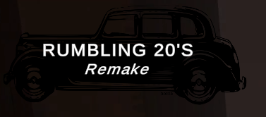

<h1>Rumbling 20's Remake</h1>

  
It's my own complete version of [Rumbling 20's](https://github.com/ThrustWorld/Rumbling20-s).  
In the updated version, I decided to refactor the entire old project to improve the code readability and the software performance.  

Above all, I worked on:  
- A complete menu section(Play, Settings, Credits, Quit,...);  
- A score system influenced by obstacles and distance;  
- Fix audio system with a valuable one;  
- Add a saving sytem;  
- Implement a better pooling system.  

If you prefer, you can directly find the build on [Itch.io](https://thrustworld.itch.io/rumbling-20s-remake) too.

<h2>Commands</h2>
- <b>A button</b> | <b>Left Arrow button</b> -> Move left.  
- <b>D button</b> | <b>Right Arrow button</b> -> Move right.

<h2>Branches</h2>
- master -> build.  
- dev -> source code for the Unity editor.
